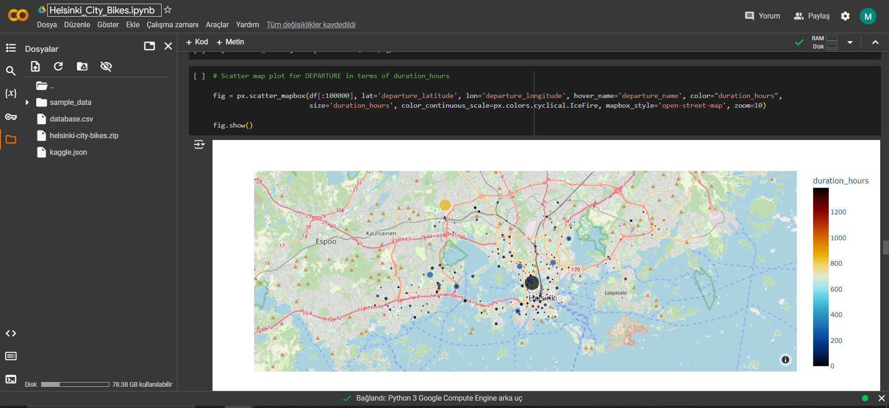

# helsinki_city_bikes_EDA
Helsinki City Bikes are shared bicycles available to the public in Helsinki and Espoo metropolitan areas. The main aim of the Helsinki city bike system is to address the so-called last-mile problem present in all distribution networks. 

It can be achieved to the dataset from Kaggle: https://www.kaggle.com/datasets/geometrein/helsinki-city-bikes/data

Since plotly graphs can not seen properly in the ipynb file, I added them here.

Departure:

Return:

Departures by Duration Hours:

Returns by Duration Hours:

